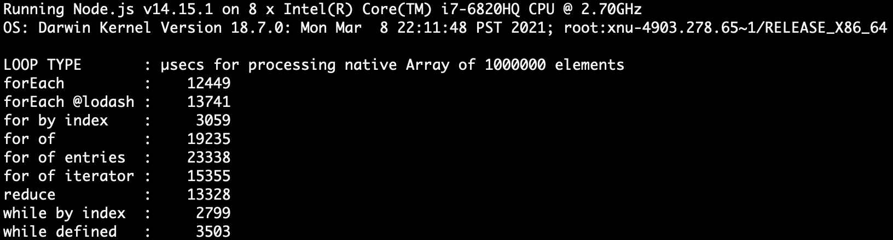

# javascript iterations benchmark

Comparing performance of different looping patterns.

## Usage

Just install the dependencies and type: `node .` or `yarn bench` or `npm run bench`.

The result will (hopefully) look something like this:

## Adding your own benchmarks

Just add your code module into benchmarks/ directory.

The module has to export a function receiving an array of integer values and an optional
size limit argument. The function has to return a bitwise xor of array elements.

In the report generated, the underscore characters in file names are changed to whitespaces.
